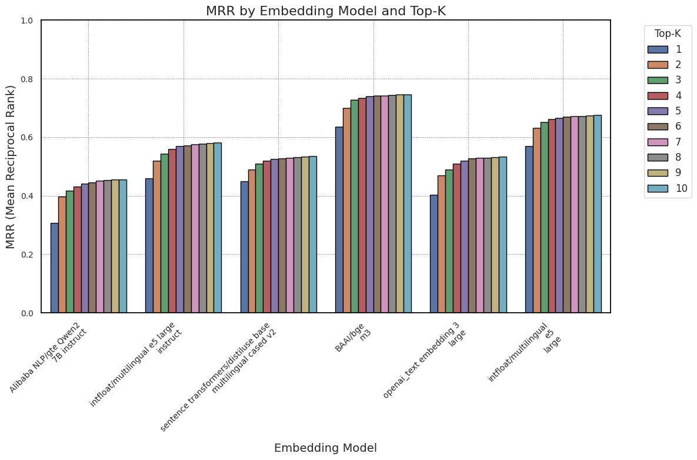
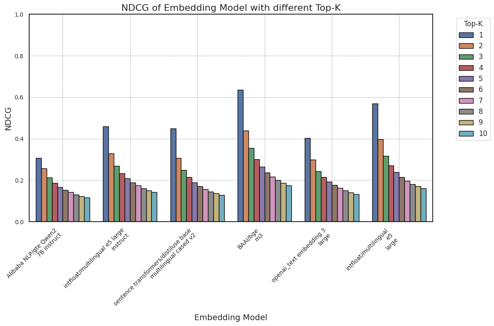
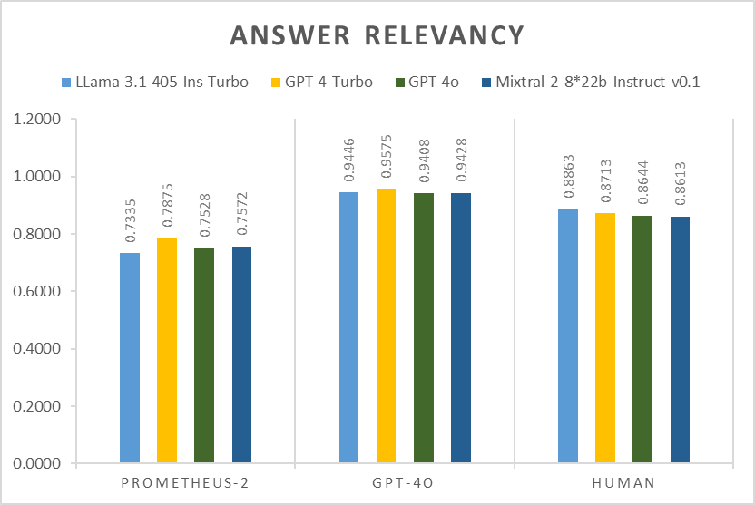
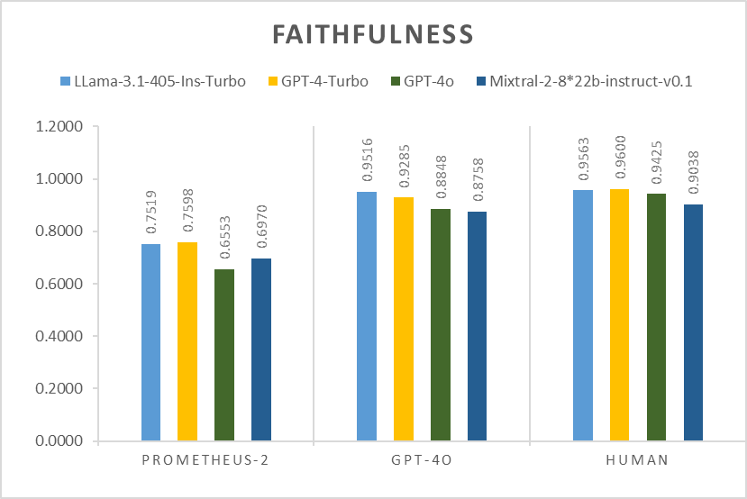
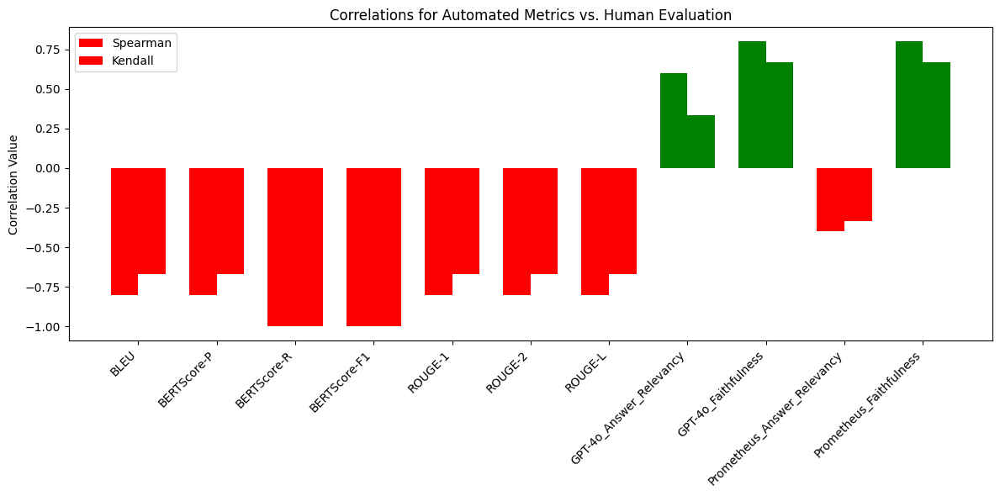

Welcome to my portfolio! I'm Pratik Sitapara, an AI Engineer passionate about bridging cutting-edge AI research with real-world applications. With two years of experience in developing and fine-tuning AI architectures, I specialize in Retrieval-Augmented Generation (RAG), Large Language Model (LLM) tuning, and AI deployment for enterprise solutions. Beyond coding, I thrive on solving complex challenges, iterating on solutions, and optimizing performance for impactful AI-driven systems. Additionally, I bring a structured working style, strong collaboration skills, and a commitment to clear and effective documentation, ensuring seamless communication with clients and teams.

---

## Education  
- *Master of Engineering* in Smart Energy Systems, Hochschule Ansbach, Germany (01/2025)  
- *Bachelor of Engineering* in Automobile, Gujarat Technological University, India (08/2020)  

---

## Technical Skills  
### *Programming & Tools*  
Python, Docker, GitHub, VS Code, LabVIEW  

### *AI & DevOps*
Open-source Models, Custom Knowledge Integration, NLP, Deep Learning, LLM Tuning & Deployment, Retrieval-Augmented Generation (RAG), Autonomous Agents, LangChain, LLamaIndex, Streamlit, ElectronJS , LLMOps, CI/CD, Monitoring & Tracing, vLLM, LiteLLM, FastAPI, Flask  

### *OCR & Document Processing*  
Email Parsing, Document Processing, Data Extraction, Chunking  

### *Database & Cloud*  
Vector Databases (FAISS, Pinecone), MongoDB, InfluxDB, SQL, AWS, Azure  

## Work & Projects  
### *Master Thesis - Evaluation & Monitoring of RAG for Enterprise Applications* (Grade: 1.3 | Duration: 6 months) 
LLMs excel in natural language understanding but often generate inaccurate responses. RAG enhances factual correctness by integrating retrieved knowledge. This study examines evaluation methodologies for RAG, incorporating traditional retrieval metrics (MRR, NDCG, Hit Rate) and generative assessment (reference-based & reference-free metrics). The research highlights how specialized fine-tuned models can serve as reliable evaluation tools, offering practical insights for optimizing enterprise RAG implementations.

  
  

  
  

  

---

### *Marius AI - RAG-Based Humanoid of Simon Marius* (Duration: 3 months)  
- Developed an optimized RAG pipeline for an AI-driven humanoid of astronomer Simon Marius.
- Reduced retrieval costs by *70%* and improved response speed by *3x*, maintaining historical accuracy in AI-generated responses.
- Enhanced knowledge retrieval, enabling seamless user interactions with the AI-powered historical figure.

  

---

### *Agent-Based Summarization Tool* (Duration: 3 months)  
- Developed the foundational Agent-based tool for a team working at Brandad, automating podcast transcript generation and summarization.
- Implemented an iterative feedback loop to ensure summaries achieved a 90% accuracy target, minimizing hallucination and delivering reliable, concise summaries that significantly enhanced content quality for the Brandad team. 

---

### *Intelligent Sector Coupling - Energy Data Monitoring Tool* (Duration: 4 months)  
- Engineered a *wireless energy monitoring system*, integrating energy meters for battery storage & EV charging.
- Developed *Python-LabVIEW architecture* to collect & process real-time energy data using Modbus sensors.
- Enhanced visualization with *Grafana*, improving issue detection and system optimization.

  
  
  

  
---

### *AI-Powered Invoice Extraction Tool* (Duration: 3 Days)  
- Automated email-based invoice extraction using *OCR* for structured data storage.
- Implemented *duplicate detection* & *recurring invoice classification*, reducing manual processing efforts.

🔗 [GitHub Repo](https://github.com/PratikSitapara22/Invoice-Extractor-Task)  
📌 *Features:*  
✔ Email Integration (Gmail/Outlook via IMAP)  
✔ Attachment Processing (PDF, PNG, JPG)  
✔ OCR-Based Data Extraction (Tesseract)  
✔ MongoDB Storage & JSON Output  
✔ Duplicate & Subscription Invoice Detection  

---

## Publications  
1. *Magenta: Metrics and Evaluation Framework for Generative Agents based on LLMs* (IHSI Conference - 2024)  
   📖 [Paper Link](https://openaccess.cms-conferences.org/publications/book/978-1-958651-95-7/article/978-1-958651-95-7_14)  
2. *Evaluierung von LLMs und Autonomen Agenten* (Ansbacher Kaleidoskop - 2024)  

  

---

## Languages  
- *English*: Business Fluent  
- *German*: Basic Communication (Learning B1)  
- *Hindi & Gujarati*: Native  

---

## Interests & Activities  
- 🧘‍♂ Spirituality  
- 🍳 Cooking  
- 📖 Reading  
- 📈 Stock Market Investment  
- 🚴‍♂ Cycling  
- ✈ Traveling (When bank balance allows!)  

---

## Connect with Me  
🚀 Looking for new opportunities to build AI-driven solutions that shape the future. Feel free to explore my work or connect for collaborations!

📩 *Email*: [ppsitaparadl@gmail.com](mailto:ppsitaparadl@gmail.com)  
💻 *GitHub*: [PratikSitapara](https://github.com/PratikSitapara)  
🔗 *LinkedIn*: [Pratik Sitapara](https://www.linkedin.com/in/pratik-sitapara-485900162/)  
📸 *Instagram*: [@sitapara_pratik](https://www.instagram.com/sitapara_pratik/)  

---

Thank you for visiting my personal portfolio website. Hope to Get In Touch Soon!
